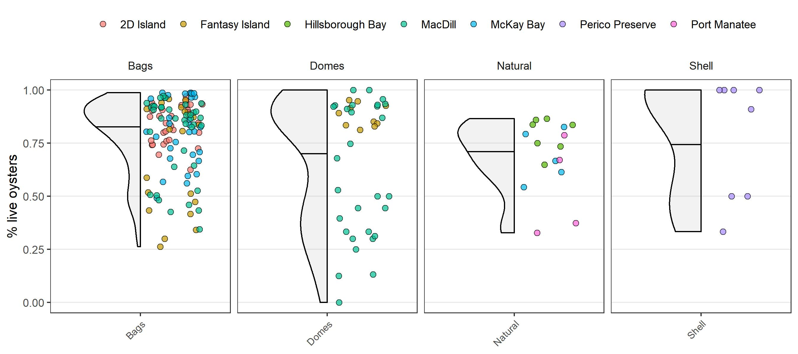

Compiled `r Sys.Date()`

```{r setup, message = F, warning = F}

knitr::opts_chunk$set(echo = TRUE, warning = F, message = F, fig.path = 'figs/')

library(tidyverse)
library(lubridate)
library(gghalves)
library(patchwork)
library(colorspace)
library(extrafont)

data(oysdat)
data(sitdat)

fml <- "Lato Light"
col <- scales::alpha('grey', 0.2)
colfct <- sequential_hcl(3, 'Batlow')

dat <- oysdat %>% 
  left_join(sitdat, by = 'id') %>% 
  mutate(
    age = case_when(
      inst_year >= 2018 ~ 'young', 
      inst_year < 2018 & inst_year >= 2015 ~ 'moderate', 
      inst_year < 2015 ~ 'old'
    ), 
    age = factor(age, levels = c('young', 'moderate', 'old')), 
    inst_year = case_when(
      is.na(inst_year) ~ 'unk', 
      T ~ as.character(inst_year)
    )
  ) %>% 
  filter(!is.na(site)) %>% 
  filter(!is.na(type))
```

# Figures {.tabset}

## % live oysters

```{r, results = 'hide'}

p <- ggplot(dat, aes(x = site, y = live_per)) + 
  geom_half_point_panel(aes(fill = age), transformation = position_jitter(width = 1, height = 0), alpha = 0.7, pch = 21, size = 2) + 
  geom_half_violin(colour = 'black', draw_quantiles = 0.5, fill = col) +
  scale_fill_manual(values = colfct) +
  facet_grid(~type, scales = 'free_x', space = 'free_x') + 
  theme_bw(base_family = fml) + 
  theme(
    legend.position = 'top',  
    panel.grid.major.x = element_blank(), 
    panel.grid.minor.x = element_blank(), 
    panel.grid.minor.y = element_blank(), 
    strip.placement = 'outside', 
    strip.background = element_blank(), 
    axis.title.x = element_blank(), 
    axis.ticks.x = element_line(), 
    # strip.text = element_text(size = 14), 
    axis.text.x = element_text(angle = 45, size = 8, hjust = 1), 
    legend.title = element_blank()
  ) +
  labs(
    y = '% live oysters'
  ) + 
  guides(fill = guide_legend(nrow = 1))
  
jpeg('figs/perclive1.jpg', height = 4, width = 9, units = 'in', res = 300, family = fml)
print(p)
dev.off()
```

```{r perclive, fig.cap = "Percent live oysters __within reef type and between site__. The left half of values show a density histogram and the right half shows percent live oysters for a plot at each site.", out.width = "100%", fig.align = 'center'}
knitr::include_graphics('figs/perclive1.jpg')
```

```{r, results = 'hide'}
p <- ggplot(dat, aes(x = type, y = live_per)) + 
  geom_half_point_panel(aes(fill = age), transformation = position_jitter(width = 1, height = 0), alpha = 0.7, pch = 21, size = 2) + 
  geom_half_violin(colour = 'black', draw_quantiles = 0.5, fill = col) +
  scale_fill_manual(values = colfct) +
  facet_grid(~site, scales = 'free_x', space = 'free_x') + 
  theme_bw(base_family = fml) + 
  theme(
    legend.position = 'top',  
    panel.grid.major.x = element_blank(), 
    panel.grid.minor.x = element_blank(), 
    panel.grid.minor.y = element_blank(), 
    strip.placement = 'outside', 
    strip.background = element_blank(), 
    axis.title.x = element_blank(), 
    axis.ticks.x = element_line(), 
    # strip.text = element_text(size = 14), 
    axis.text.x = element_text(angle = 45, size = 8, hjust = 1), 
    legend.title = element_blank()
  ) +
  labs(
    y = '% live oysters'
  ) + 
  guides(fill = guide_legend(nrow = 1))
  
jpeg('figs/perclive2.jpg', height = 4, width = 9, units = 'in', res = 300, family = fml)
print(p)
dev.off()
```

```{r perclive2, fig.cap = "Percent live oysters __within site and between reef type__. The left half of values show a density histogram and the right half shows percent live oysters for a plot at each site.", out.width = "100%", fig.align = 'center'}

```

```{r, results = 'hide'}
p <- ggplot(dat, aes(x = age, y = live_per)) + 
  geom_half_point_panel(aes(fill = site), transformation = position_jitter(width = 1, height = 0), alpha = 0.7, pch = 21, size = 2) + 
  geom_half_violin(colour = 'black', draw_quantiles = 0.5, fill = col) +
  facet_grid(~type, scales = 'free_x', space = 'free_x') + 
  theme_bw(base_family = fml) + 
  theme(
    legend.position = 'top',  
    panel.grid.major.x = element_blank(), 
    panel.grid.minor.x = element_blank(), 
    panel.grid.minor.y = element_blank(), 
    strip.placement = 'outside', 
    strip.background = element_blank(), 
    axis.title.x = element_blank(), 
    axis.ticks.x = element_line(), 
    # strip.text = element_text(size = 14), 
    axis.text.x = element_text(angle = 45, size = 8, hjust = 1), 
    legend.title = element_blank()
  ) +
  labs(
    y = '% live oysters'
  ) + 
  guides(fill = guide_legend(nrow = 1))
  
jpeg('figs/perclive3.jpg', height = 4, width = 9, units = 'in', res = 300, family = fml)
print(p)
dev.off()
```

```{r perclive3, fig.cap = "Percent live oysters __within reef type and between reef age__. The left half of values show a density histogram and the right half shows percent live oysters for a plot at each site.", out.width = "100%", fig.align = 'center'}

```


```{r, results = 'hide'}
p <- ggplot(dat, aes(x = type, y = live_per)) + 
  geom_half_point_panel(aes(fill = site), transformation = position_jitter(width = 1, height = 0), alpha = 0.7, pch = 21, size = 2) + 
  geom_half_violin(colour = 'black', draw_quantiles = 0.5, fill = col) +
  facet_grid(~age, scales = 'free_x', space = 'free_x') + 
  theme_bw(base_family = fml) + 
  theme(
    legend.position = 'top',  
    panel.grid.major.x = element_blank(), 
    panel.grid.minor.x = element_blank(), 
    panel.grid.minor.y = element_blank(), 
    strip.placement = 'outside', 
    strip.background = element_blank(), 
    axis.title.x = element_blank(), 
    axis.ticks.x = element_line(), 
    # strip.text = element_text(size = 14), 
    axis.text.x = element_text(angle = 45, size = 8, hjust = 1), 
    legend.title = element_blank()
  ) +
  labs(
    y = '% live oysters'
  ) + 
  guides(fill = guide_legend(nrow = 1))
  
jpeg('figs/perclive4.jpg', height = 4, width = 9, units = 'in', res = 300, family = fml)
print(p)
dev.off()
```

```{r perclive4, fig.cap = "Percent live oysters __within reef age and between reef type__. The left half of values show a density histogram and the right half shows percent live oysters for a plot at each site.", out.width = "100%", fig.align = 'center'}

```